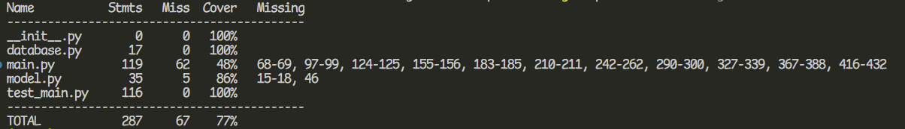
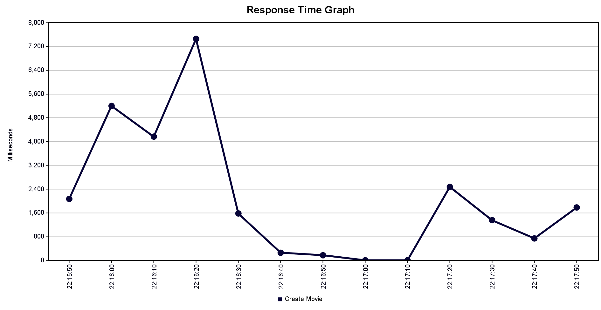

# Software Engineering - Final Exam

Group: Sofwer (Diego Quispe, Daniel Casquino)

1. Database is created automatically with fastapi. Models can be found at model.py

2. Integration test: :(

3. Complete api code can be found at main.py

4. Code coverage is at 77%, as we're not testing every single possible case (they do work though)

5. Happy Path endpoint < 1000ms The latency graph shows that, when not under inmense stress, the create user endpoint has less that 1000ms latency :)

6. 400 and 500 are documented, can be accessed via localhost:8000/redoc (swagger), can also be read in the pdf

7. 95% availability: Our create user endpoint was tested with 1000 threads (users) per second. It has a 0% error rate, so availability is 100% :) Can also be seen in availability.csv

8. 95% reliability: Our create user endpoint was tested with 20000 individual users. It has a 0% error rate, so reliabilty is at 100%. Results can be seen in reliability.csv.

9. Performance Testing: Stress Testing

We tested with 5000 users per second, and the API froze. 500 users per second worked, and we then increased the user count to 1000. It worked until it reached a consistent 1500~ users per second, and then it started sending 500 internal server errors, but without freezing. We concluded that the bottleneck is the DB connection, as it exceeded the 25 concurrent connections we set up in database.py

10. CAP Theorem combination:

The combination of Consistency and Availability was chosen. This is because in a system where you can buy/reserve/cancel tickets, it is important to have the most recent information. If a user buys a ticket, it is important that the ticket is no longer available to other users, and it is similar when a user uses a ticket so it is not available to other users. This is why we chose Consistency and Availability.

11. Logs can be viewed in the /logs folder, they were added to the create user endpoint

12. 1000 Requests: The create user endpoint was chosen for the 1k requests, most recent logs are in the log_DD_MM_YYYY.log file

13. The date parsing and success/fail counting function is the function named count_logs inside main.py
